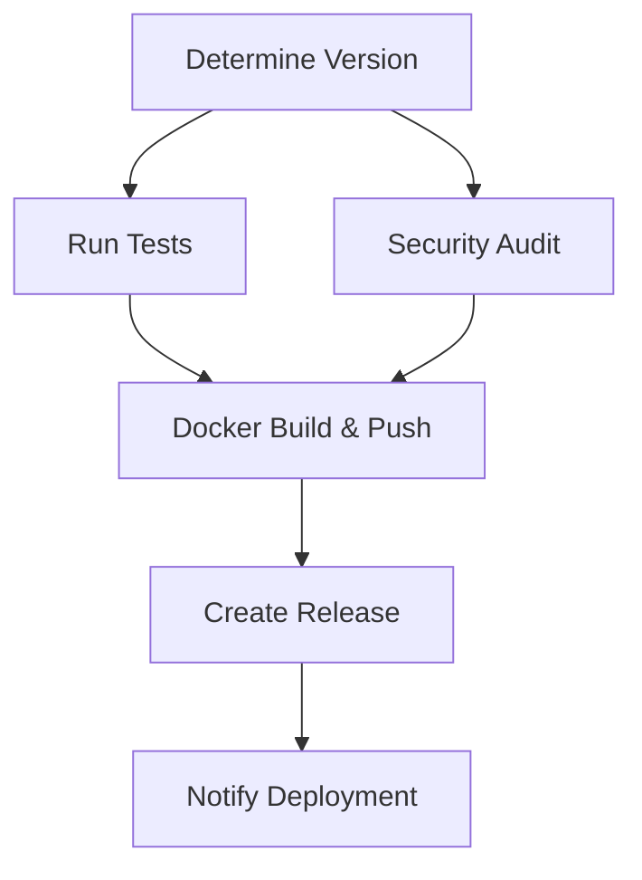

# 🚀 CI/CD Pipeline Documentation

## Overview

This document describes the comprehensive CI/CD pipeline for the UFC Auth API, implementing 2025 industry best practices for Node.js applications with Docker, semantic versioning, and automated releases.

## 🏗️ Pipeline Architecture

The CI/CD pipeline consists of 6 main jobs that run in sequence:



## 📋 Jobs Description

### 1. 📊 Determine Version
- **Purpose**: Automatically determines the next version using semantic versioning
- **Technology**: [paulhatch/semantic-version](https://github.com/paulhatch/semantic-version)
- **Triggers**:
  - `feat:` or `feature:` → Minor version bump
  - `fix:` or `patch:` → Patch version bump
  - `BREAKING CHANGE` or `MAJOR` → Major version bump
- **Output**: Version number, Git tag, and release flag

### 2. 🧪 Run Tests
- **Purpose**: Validates code quality and functionality
- **Matrix Strategy**: Tests against Node.js 18.x, 20.x, and 22.x
- **Steps**:
  - Linting with ESLint
  - Unit tests with Jest
  - Coverage report generation
  - Upload to Codecov (optional)

### 3. 🔒 Security Audit
- **Purpose**: Identifies security vulnerabilities
- **Tools**:
  - `npm audit` for dependency vulnerabilities
  - Snyk security scanning
- **Threshold**: High severity issues will fail the build

### 4. 🐳 Docker Build & Push
- **Purpose**: Creates and publishes Docker images
- **Features**:
  - Multi-architecture builds (linux/amd64, linux/arm64)
  - Multi-stage Dockerfile optimization
  - Layer caching for faster builds
  - Trivy vulnerability scanning
  - OCI-compliant metadata labels
- **Tags Generated**:
  - `latest` (for main branch)
  - `v{version}` (semantic version)
  - `v{major}.{minor}` (minor version)
  - `v{major}` (major version)

### 5. 🎉 Create Release
- **Purpose**: Creates Git tags and GitHub releases
- **Features**:
  - Automated changelog generation
  - Release notes with categorized changes
  - Docker image information in release notes
  - Artifact attachments (documentation)

### 6. 📢 Notify Deployment
- **Purpose**: Sends deployment notifications
- **Integrations**:
  - Slack notifications (optional)
  - GitHub deployment status

## 🔧 Required Secrets

Configure these secrets in your GitHub repository settings:

### Docker Hub
```bash
DOCKER_HUB_USERNAME=teomaz
DOCKER_HUB_TOKEN=your_docker_hub_access_token
```

### Optional Integrations
```bash
CODECOV_TOKEN=your_codecov_token          # For coverage reports
SNYK_TOKEN=your_snyk_token                # For security scanning
SLACK_WEBHOOK_URL=your_slack_webhook      # For notifications
```

## 🏷️ Semantic Versioning

The pipeline follows [Semantic Versioning 2.0.0](https://semver.org/) principles:

### Commit Message Patterns

| Pattern | Version Bump | Example |
|---------|--------------|---------|
| `feat:` or `feature:` | Minor | `feat: add 2FA support` |
| `fix:` or `patch:` | Patch | `fix: resolve login issue` |
| `BREAKING CHANGE` | Major | `feat: new auth system BREAKING CHANGE` |
| `chore:`, `docs:`, `style:` | Patch | `docs: update API documentation` |

### Version Examples
- `1.0.0` → `1.0.1` (patch: bug fix)
- `1.0.1` → `1.1.0` (minor: new feature)
- `1.1.0` → `2.0.0` (major: breaking change)

## 🐳 Docker Best Practices

### Multi-Stage Build
The Dockerfile uses a 3-stage build process:

1. **Dependencies**: Install all dependencies
2. **Build**: Run tests, linting, and cleanup
3. **Production**: Minimal runtime image

### Security Features
- Non-root user execution
- Security updates in base image
- Minimal attack surface
- Health checks
- Proper signal handling with `tini`

### Image Optimization
- Alpine Linux base (smaller size)
- Layer caching
- `.dockerignore` for build optimization
- Multi-architecture support

## 🚀 Usage Guide

### Triggering Builds

#### Automatic Triggers
- **Push to `main`**: Full pipeline with release
- **Push to `develop`**: Build and test only
- **Pull Request**: Test and security audit only

#### Manual Trigger
```bash
# Via GitHub UI: Actions → CI/CD Pipeline → Run workflow
# Or via GitHub CLI:
gh workflow run ci-cd.yml
```

### Release Process

1. **Development**: Work on feature branches
2. **Pull Request**: Create PR to `main` (triggers tests)
3. **Merge**: Merge PR to `main` (triggers full pipeline)
4. **Automatic**: Pipeline determines version and creates release

### Docker Image Usage

```bash
# Pull latest version
docker pull teomaz/ufc_auth:latest

# Pull specific version
docker pull teomaz/ufc_auth:v1.2.3

# Run container
docker run -p 3000:3000 teomaz/ufc_auth:latest
```

## 📊 Monitoring and Observability

### Build Status
- GitHub Actions dashboard
- Commit status checks
- PR status indicators

### Security Monitoring
- Trivy vulnerability reports
- Snyk security alerts
- npm audit results

### Coverage Tracking
- Codecov integration
- Coverage reports in artifacts
- Trend analysis

## 🔧 Customization

### Adding New Jobs
Add jobs to `.github/workflows/ci-cd.yml`:

```yaml
new-job:
  name: 🆕 New Job
  runs-on: ubuntu-latest
  needs: [determine-version]
  steps:
    - name: Custom step
      run: echo "Custom logic here"
```

### Modifying Version Patterns
Update the `determine-version` job:

```yaml
- name: 📊 Determine version
  uses: paulhatch/semantic-version@v5.4.0
  with:
    major_pattern: "(BREAKING|MAJOR)"
    minor_pattern: "(feat|feature|minor)"
    patch_pattern: "(fix|patch|hotfix)"
```

### Environment-Specific Deployments
Add deployment jobs for different environments:

```yaml
deploy-staging:
  if: github.ref == 'refs/heads/develop'
  # Staging deployment logic

deploy-production:
  if: github.ref == 'refs/heads/main'
  # Production deployment logic
```

## 🐛 Troubleshooting

### Common Issues

#### Build Failures
1. **Test failures**: Check test logs in Actions tab
2. **Linting errors**: Run `npm run lint:fix` locally
3. **Security vulnerabilities**: Update dependencies

#### Docker Issues
1. **Build failures**: Check Dockerfile syntax
2. **Push failures**: Verify Docker Hub credentials
3. **Size issues**: Optimize .dockerignore

#### Version Issues
1. **Wrong version**: Check commit message patterns
2. **No version bump**: Ensure proper commit format
3. **Tag conflicts**: Delete conflicting tags

### Debug Commands

```bash
# Test locally
npm run test:unit
npm run lint
npm run security:audit

# Build Docker image locally
docker build -t ufc_auth:test .

# Test Docker image
docker run -p 3000:3000 ufc_auth:test
```

## 📚 References

- [GitHub Actions Documentation](https://docs.github.com/en/actions)
- [Docker Best Practices](https://docs.docker.com/develop/dev-best-practices/)
- [Semantic Versioning](https://semver.org/)
- [Node.js Docker Best Practices](https://github.com/nodejs/docker-node/blob/main/docs/BestPractices.md)
- [OCI Image Specification](https://github.com/opencontainers/image-spec)

## 🤝 Contributing

1. Follow semantic commit message format
2. Ensure tests pass locally
3. Update documentation for new features
4. Test Docker builds locally before pushing

---

**Note**: This pipeline follows 2025 industry best practices and is designed for production use. Regular updates and security patches are recommended. 